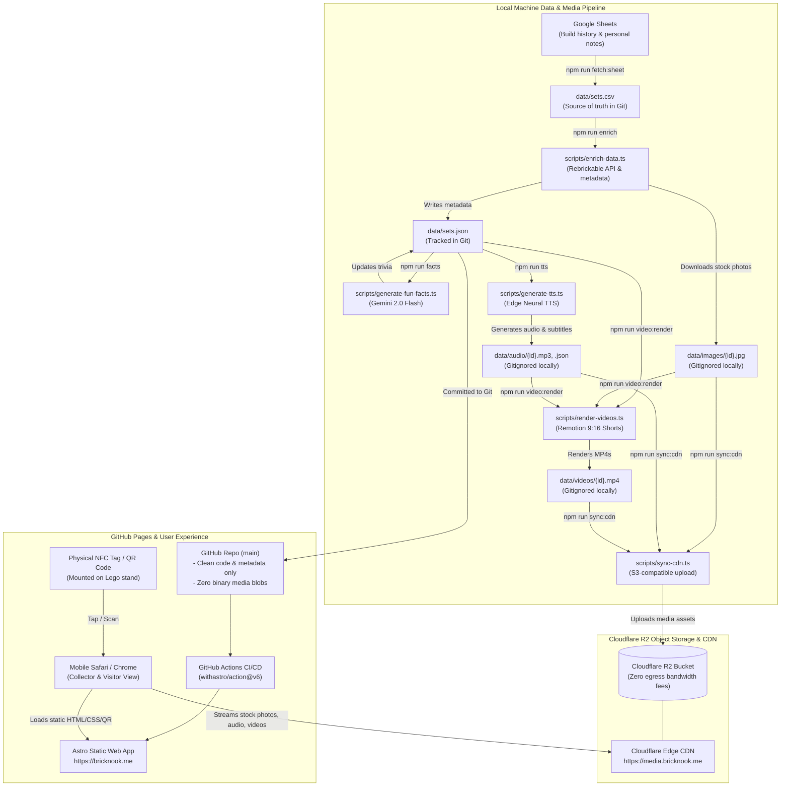

# Architecture & Design: Brick Nook

## 1. Executive Summary
**Brick Nook** is a static web app and media showcase for a personal collection of ~100+ Lego sets. 

The primary physical interaction model is scanning:
- Every displayed Lego set has a physical NFC / RFID tag or a small printed QR code card.
- Tapping or scanning immediately opens that specific set's card page on mobile.
- Visitors can view official stock imagery, technical specifications (piece count, release year, dimensions/theme), personal build logs (who built it, how long it took, completion date), and fun facts.
- When ready, each set page also embeds an automated vertical video highlight reel generated programmatically with Remotion and neural TTS audio.

---

## 2. High-Level Architecture



---

## 3. Technology Stack Decisions

| Layer / Need | Technology | Rationale |
| :--- | :--- | :--- |
| **Data Source** | CSV (`data/sets.csv`) | Simple to export from Google Sheets / Excel, easy to edit locally or track in git. |
| **Metadata & Imagery** | Rebrickable API + Gemini API | Reliable Lego catalog API for specs & stock photos, plus Gemini 2.0 Flash for set trivia. |
| **Media Hosting & CDN** | **Cloudflare R2** (`media.bricknook.me`) | S3-compatible object storage with **zero egress fees**. Keeps large images, MP3s, and MP4 videos out of Git and GitHub Pages while streaming globally at edge speeds. |
| **Web Framework** | **Astro 5** + Tailwind CSS | Zero client-side JavaScript by default, instant page load speeds on mobile, rich image optimization, content collections with type safety. |
| **Dynamic QR Codes** | Astro Static Endpoints + `sharp` | Generates lightweight SVG, WebP, and PNG Lego stud QR codes on the fly at build time without offline generation scripts or external CLI tools. |
| **Physical Scannability** | QR Codes + Clean URLs | Clean set URLs (`/sets/10497`) easily programmed onto NFC NTAG213/215 stickers or printed onto collectible physical cards. |
| **Video Engine** | **Remotion** (React) | Code-driven motion graphics; allows reusing web CSS tokens, responsive typography, Ken Burns stock photo animations, and CLI batch rendering. |
| **Voiceover Engine** | `msedge-tts` (Edge Neural TTS) | Completely free, natural Microsoft neural voices without API rate limits or recurring costs. |
| **Hosting & CI/CD** | GitHub Pages + GitHub Actions | Free, zero maintenance static hosting automatically updated on git push via `withastro/action`. |

---

## 4. Mobile-First Card UX & Scannability

### Physical Tagging Model
- **URL Route Pattern**: `https://bricknook.me/sets/<set_number>`
- **NFC / RFID**: NTAG213 / NTAG215 stickers (144 - 504 bytes) programmed with the direct URL. When a phone taps the tag on the Lego display stand, it opens directly in Safari/Chrome.
- **Printed Cards**: Each set card page provides a printable mini-card view (or downloadable QR code SVG) to place on physical display stands.

### Mobile Screen Architecture
1. **Header / Identity**: Set number badge, official theme pill, year, and set title.
2. **Hero Visual**: Crisp stock photo loaded directly from CDN (`media.bricknook.me/images/{id}.jpg`) with clean modal preview.
3. **Key Stats Grid (2x2 or 3x1 on mobile)**:
   - Pieces ($1,254$)
   - Build Time ($4.5\text{ hrs}$)
   - Built By (e.g., *Bram & Family*)
   - Rating ($5/5\star$)
4. **Story & Fun Facts**: Personal notes, build history, official Lego trivia.
5. **Video Showcase**: Compact HTML5 9:16 video player streaming from `media.bricknook.me/videos/{id}.mp4` with custom play button and animated captions.
6. **QR Share & Navigation**: "Back to Collection" and "Show QR Code" modal for quick scanning by friends.

---

## 5. Data Flow & Schema

### Normalized Enriched Set (`data/sets.json`)
```typescript
interface LegoDimensions {
  height?: number; // cm
  width?: number;  // cm
  depth?: number;  // cm
}

interface EnrichedLegoSet {
  id: string;                    // "10497"
  setNum: string;                // "10497-1"
  name: string;                  // "Galaxy Explorer"
  year: number;                  // 2022
  theme: string;                 // "Classic Space / Icons"
  collection?: string;           // "Starwars Helmets"
  pieces: number;                // 1254
  imageUrl: string;              // Remote fallback CDN URL (Rebrickable)
  media?: {
    image?: string;              // "images/10497.jpg" (served via media.bricknook.me)
    audio?: string;              // "audio/10497.mp3"
    subtitles?: string;          // "audio/10497.json"
    video?: string;              // "videos/10497.mp4"
  };
  dateStarted?: string;          // "2023-08-10 19:30" (when build began)
  dateFinished?: string;         // "2023-08-15 21:00" (when build finished)
  buildDate?: string;            // "2023-08-15" (primary build completion date)
  buildTimeHours?: number;       // 4.5 (actual build time spent between dates)
  timeToBuildFormatted?: string; // "4h 30m"
  rating?: number;               // 4.5 (overall / Brickset community)
  ratingBuild?: number;          // 5 (user build experience rating)
  ratingLooks?: number;          // 4 (user display aesthetics rating)
  funFacts: string;              // Trivia / notes
  notes?: string;                // Display location, etc.
  dimensions?: LegoDimensions;
}
```

### Media URL Resolution
All media references are resolved dynamically in Astro via a central helper (`site/src/lib/assets.ts`):
- Production: `https://media.bricknook.me/<path>`
- Development fallback: configured via `PUBLIC_MEDIA_BASE_URL` in `.env`.

---

## 6. Data Pipeline Principles & Layer Responsibilities

To ensure predictable data evolution and avoid data loss or coupling, the system maintains a strict separation between **Ingestion/Enrichment** and **Presentation**:

### Principle 1: Ingestion & Enrichment Maintains High Fidelity
The enrichment script (`scripts/enrich-data.ts`) and backend adapters (`scripts/backends/`) are responsible for merging external catalog data with the personal spreadsheet without editorial modification:
- **Raw Fidelity**: Keep set titles, themes, and descriptions as published by external sources (LEGO.com, Brickset, Rebrickable) or logged by the user in `sets.csv`.
- **Lossless Transformations Only**:
  - Type coercion (e.g. converting piece count strings to integers, dimension strings to numbers in centimeters).
  - Date parsing and normalization into standard representation (`dateReleased`, `dateRetired`, `year`).
  - Unit normalization (e.g. converting inches to centimeters for physical dimensions).
- **No Editorial Censoring or Truncation**: Do **not** strip title suffixes (such as `" - UCS"`), parenthetical notes (`"{2nd edition}"`), or catalog hierarchies at ingestion time. Storing the full original title preserves searchability, accurate catalog matching, and lossless round-tripping when re-running `npm run enrich`.

### Principle 2: Presentation Layers Own Formatting & Contextual Cleaning
Each consumer transforms and cleans the normalized data to suit its specific medium:
- **Spoken Audio & Voiceover Narration (`scripts/generate-tts.ts`, `templates/narration.liquid`)**:
  - Strips redundant acronyms from titles where the narration already introduces the series (e.g. `"AT-AT - UCS"` becomes `"AT-AT"` because the line introduces it as the *"Star Wars UCS line"*).
  - Simplifies deep catalog themes (e.g. `"The Hobbit & The Lord of the Rings / The Lord of the Rings / Icons (...)"` $\rightarrow$ `"Lord of the Rings"`).
  - Omits duplicate collective nouns (e.g. avoiding *"from the Star Wars Helmet Collection line"*).
  - Synthesizes Gift with Purchase (GWP) relationships (*"Released as a gift with purchase alongside Barad-dûr"*).
  - Liquid templates own the sentence structure, grammar, and phrasing; TypeScript acts solely as the data provider.
- **Web Showcase (`site/`)**:
  - Displays canonical set titles and official specs.
  - Renders contextual badges (e.g. `"🎁 Gift with Purchase"`, `"Retired: 2024"`).
- **Video Motion Graphics (`video/`)**:
  - Adapts font sizes, line wrapping, and layout to fit 9:16 vertical video constraints.
